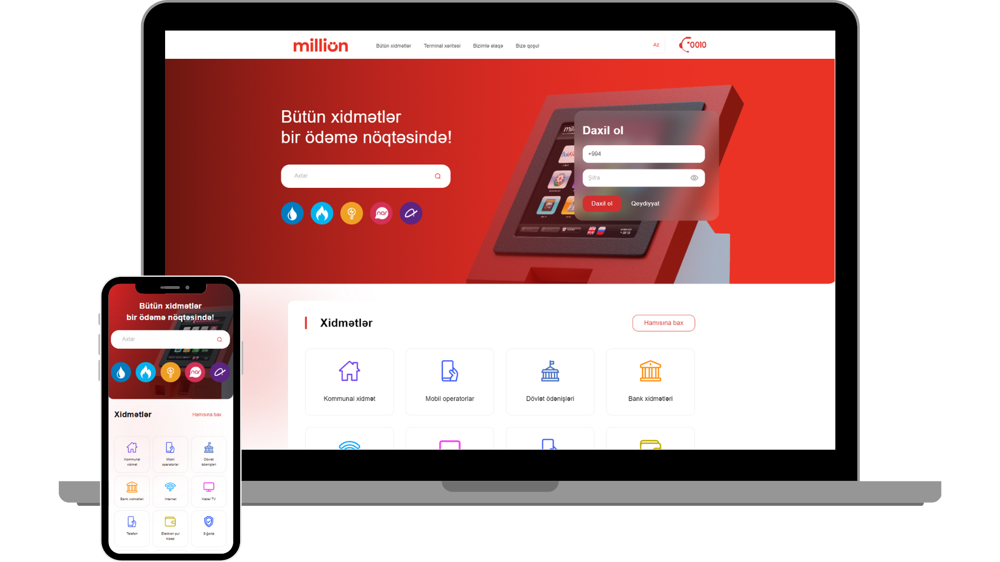

<h2 align="center">
  MilliOn (Clone) 
  <a href="https://imrashidov.github.io/Million.az-Website-Clone-Project/" target="_blank">Github.io</a>
</h2>

  

<h3 align="center">
    🔹
    <a href="https://github.com/imrashidov/Million.az-Website-Clone-Project/issues">Report Bug</a> &nbsp; &nbsp;
</h3>

## Built With

- React.js
- React Router
- Material UI
- i18next
- Formik

## Features

**🎨 Styled with Material UI and CSS**

**📱 Fully Responsive**

## 🛠 Installation and Setup Instructions

1. Installation: `npm install`

2. In the project directory, you can run: `npm start`

Runs the app in the development mode.\
Open [http://localhost:3000](http://localhost:3000) to view it in the browser.
The page will reload if you make edits.

### Show your support

Give a ⭐ if you like this website!

